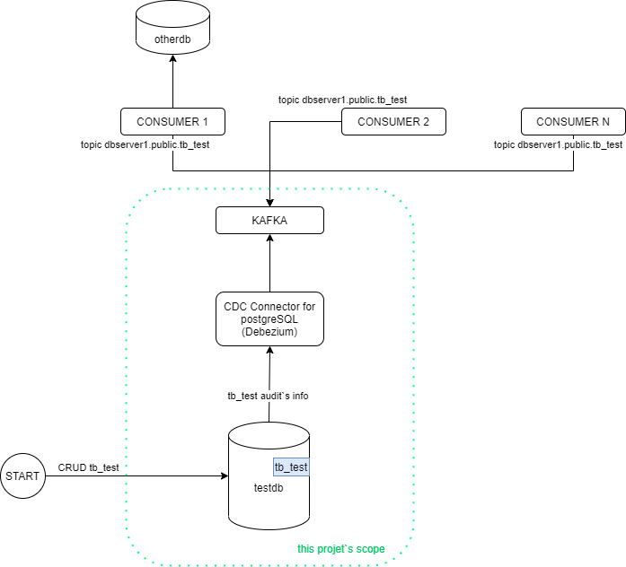

## CDC DEBEZIUM WITH POSTGRESQL
A simple CDC Debezium test:
	- CDC Debezium will listen to PostgreSQL database testdb and table tb_test. After CRUD, 
the CDC will take an audit data (tb_test) and send's to kafka

Obs.: Docker compose will create the containers
	- PostgreSQL Database;
	- Kafka
	- Zoopeeker
	- CD Debezium conector, configured for PostgreSQL

### Instructions by Kazuo
 

#### Execute at the first time 
- Run docker build to build the images (mianly because of postgreSql's configurations):
  - `docker build . -t cdc:latest`
- Now, let's run only docker compose of db's service:
  - `docker-compose up dbcdc`
- After db service is up, let's execute the script (script.sql file) to create the tb_test table:
  - `cat script.sql | docker exec -i postgres-cdc psql -U "postgres" -d "testdb" -W "password@123456" `
- Now, you can stop docker compose:
  - `docker-compose down`

#### When you want to start the services via Docker (docker compose)
- Run docker compose to start all services:
  - `docker-compose up`
- Import Postman's collection, and execute postman's post method to Create the Kafka's Topic.
  - After executing, you can verify if everything is running (see the other Postman Request from collection)
- Now, you can verify if kafka topic (dbserver1.public.tb_test) was created. At prompt command, you can execute:
  - `docker exec -it kafka sh /usr/bin/kafka-topics --zookeeper zookeeper:2181 --list`

#### If you didn't create any kafka's consumer, but you want to see if a consumer will work
- You can test a kafka's consumer, running the coommand at prompt command (the port is 9092 beacuse you're running under kafka's container):
  - `docker exec -it kafka sh /usr/bin/kafka-console-consumer --bootstrap-server kafka:9092 --topic dbserver1.public.tb_test --from-beginning`

#### If you want to test your consumer:
- topic: dbserver1.public.tb_test
- use the port to kafka's: 9093 (if you're using outside kafka's container network. But, if you're running under, use the port 9092)

###### Este projeto foi uma experimentação particular e bem simples, para avaliar a utilização de um CDC que realiza a leitura de uma tabela de banco de dados específica e envia ao Kafka 

{width=60%}